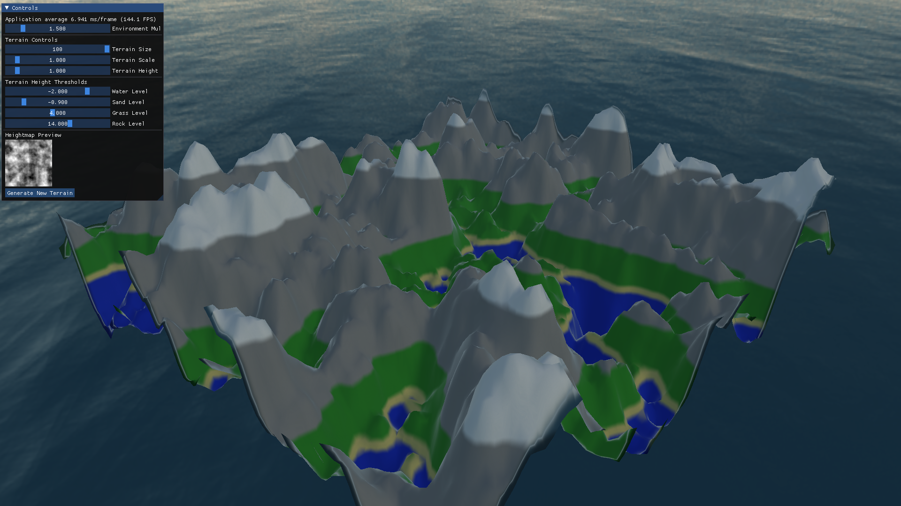

# Terra-GL

A computer graphics project developed for the course
DAT205 Advanced Computer Graphics at Chalmers University of Technology.



<!--toc:start-->
- [Project Overview](#project-overview)
- [Features](#features)
- [Building the Project](#building-the-project)
  - [Prerequisites](#prerequisites)
  - [Build Instructions](#build-instructions)
  - [Running the Application](#running-the-application)
- [Project Structure](#project-structure)
- [Contributing](#contributing)
<!--toc:end-->

## Project Overview

Terra-GL is a simple real-time procedural terrain generator
written in C++ using OpenGL.

## Features

- [x] Basic terrain generation using accumulated Perlin noise
- [x] Camera controls
- [x] Basic lighting and shading
- [x] Height-based color mapping
- [ ] Blended texture height/slope mapping
- [ ] Water reflection and refraction (simulation?)
- [ ] Vegetation placement and rendering
- [ ] Day/night cycle with dynamic lighting
- [ ] Weather effects (rain, snow, fog)
- [ ] Performance optimization for large terrains

## Building the Project

### Prerequisites

- CMake (version 3.5 or higher)
- C++11 compatible compiler
- OpenGL
- SDL2

### Build Instructions

1. Clone the repository:

```bash
git clone https://github.com/yourusername/terra-gl.git
cd terra-gl
```

2. Create a build directory and configure the project:

```bash
mkdir build
cd build
cmake ..
```

3. Build the project:

```bash
make
```

### Running the Application

After building, you can run the application from the build directory:

```bash
./project/project
```

## Project Structure

- `project/` - Main project source code
- `labhelper/` - Helper library from the course
- `external/` - External dependencies
- `scenes/` - Scene assets

## Contributing

This is a course project and contributions are not expected.
However, if you find any issues or have suggestions,
feel free to open an issue in the repository.
